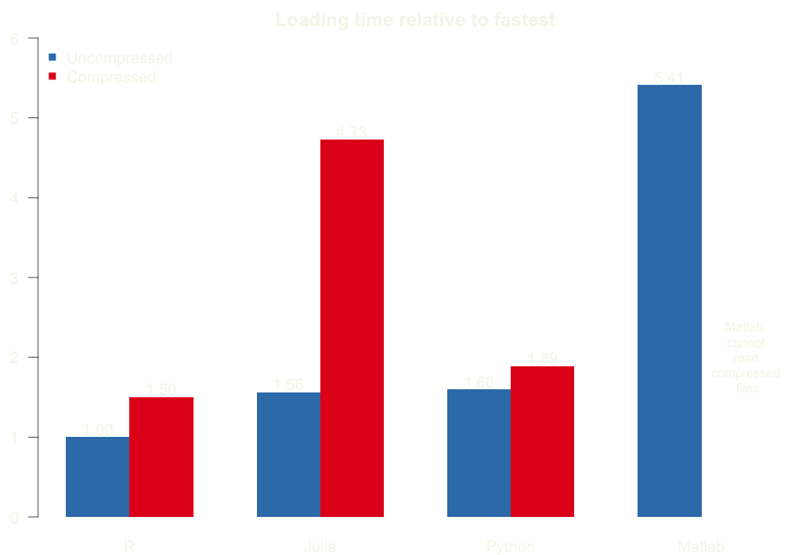
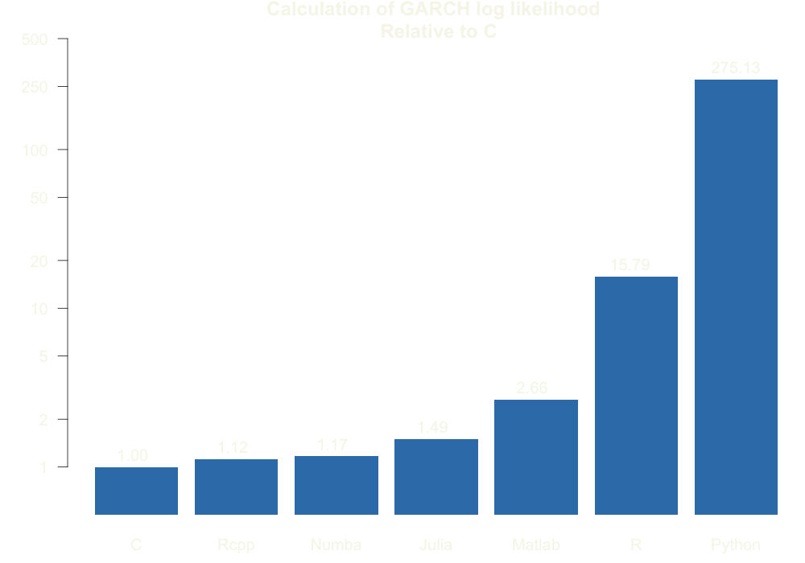

# Speed

As part of the work I did for the SRC, we wanted to see how fast are the four main languages used in computational finance (Julia, Python, R, Matlab) when loading and performing an operation on very large databases. For this, I used the "crsp_daily.gz" file, which holds historical data on daily stock prices. The file had a compressed weight of 1.03 GB, and contained over 97 million rows and 11 columns.

The project bash code run.sh executes the scripts for each language five times and outputs the elapsed time for reading the compressed file, uncompressed file, and performing a data manipulation (calculating annual mean and standard deviation per PERMNO)

To expand on this, we also tested the speed of Julia, Python, R and Matlab, along with the decorated version of Numba, Rcpp, and C, when computing GARCH log likelihood:

